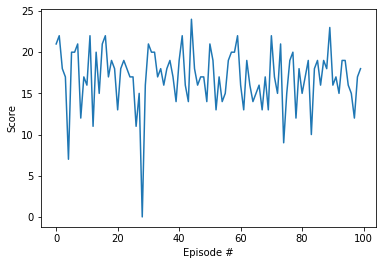
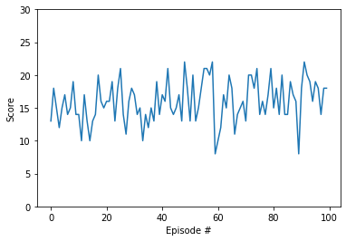

[//]: # (Image References)

[image1]: https://user-images.githubusercontent.com/10624937/42135619-d90f2f28-7d12-11e8-8823-82b970a54d7e.gif "Trained Agent"

# Project 1: Navigation

### Introduction

In this project, we will train an agent to navigate (and collect bananas!) in a large, square world.  

![Trained Agent][image1]

A reward of +1 is provided for collecting a yellow banana, and a reward of -1 is provided for collecting a blue banana.  
Thus, the goal of your agent is to collect as many yellow bananas as possible while avoiding blue bananas.  

The state space has 37 dimensions and contains the agent's velocity, along with ray-based perception of objects around agent's forward direction.  
Given this information, the agent has to learn how to best select actions.  Four discrete actions are available, corresponding to:
- **`0`** - move forward.
- **`1`** - move backward.
- **`2`** - turn left.
- **`3`** - turn right.

#### States info
According to some comments in the course message more detail info on the states can be found in [Unity GitHub](https://github.com/Unity-Technologies/ml-agents/issues/1134)  
From those comments it appears that 2 of the 37 states are for velocities, 7 are angles of rays and   
5 are states [Banana {0,1}, Wall {0,1}, BadBanana {0,1}, Agent {0,1}, Distance {fraction of the ray length}]  
example: 
[0, 1, 1, 0, 0.2] 
There is a BadBanana detected 20% of the way along the ray and a wall behind it.  

While we want the RL to learn without knowing anything on the state, prior knowledge might be able 
to help with hyper parameter tuning and create Neural Net that process better the data, 

### Getting Started

1. Download the environment from one of the links below.  You need only select the environment that matches your operating system:
    - Linux: [click here](https://s3-us-west-1.amazonaws.com/udacity-drlnd/P1/Banana/Banana_Linux.zip)
    - Mac OSX: [click here](https://s3-us-west-1.amazonaws.com/udacity-drlnd/P1/Banana/Banana.app.zip)
    - Windows (32-bit): [click here](https://s3-us-west-1.amazonaws.com/udacity-drlnd/P1/Banana/Banana_Windows_x86.zip)
    - Windows (64-bit): [click here](https://s3-us-west-1.amazonaws.com/udacity-drlnd/P1/Banana/Banana_Windows_x86_64.zip)
    
    (_For Windows users_) Check out [this link](https://support.microsoft.com/en-us/help/827218/how-to-determine-whether-a-computer-is-running-a-32-bit-version-or-64) if you need help with determining if your computer is running a 32-bit version or 64-bit version of the Windows operating system.

    (_For AWS_) If you'd like to train the agent on AWS (and have not [enabled a virtual screen](https://github.com/Unity-Technologies/ml-agents/blob/master/docs/Training-on-Amazon-Web-Service.md)), then please use [this link](https://s3-us-west-1.amazonaws.com/udacity-drlnd/P1/Banana/Banana_Linux_NoVis.zip) to obtain the environment.

2. Place the file in the DRLND GitHub repository, in the `p1_navigation/` folder, and unzip (or decompress) the file. 

### Project notes
Initially put some of the code in `Navigation_tools.py` in order to keep `Navigation.ipynb` cleaner looking,
but there were some `Broken pipe` issues with running the app this way, so I just copied to code into `Navigation.ipynb`

The work includes:
- In `Navigation.ipynb`
  - Basic environment exploration 
  - Average games scores info when playing multiple using uniformly random action selection 
  - using the functions from `Navigation_tools.py`
  - Train the model using DQN
  - Train the model using DQN with dropout layer
  - Run 100 episodes using the trained DQN model `checkpoint.pth`
  - Run 100 episodes using the trained DQN dropout model `checkpoint_dropout.pth`
- In `Navigation_tools.py`
  - Code for training the model using basic DQN (same as the one in the DQN lesson) and with dropout layers
  - I've created a model with additional hidden layer and layers sizes of 128, 64 and 32 
    but it learned in a slower rate so I stopped it and did not keep the model so I did not include it in the code

Dropout layers:
Adding dropout to model, training and saving to `checkpoint_dropout.pth`
- Model `QNetwork2` in `model.py`
- Goal was to see if we can train faster and if we can get better score.
  - it got to 100 episodes score of 13.5 at episode 700
  - There were oscillation when reached to average score of about 15.5, after episode 800 
  - Did not improved significantly even after 1,500 episodes

Results   
The model without the dropout, `checkpoint.pth`, got to a better final model, thought I did not let the one   
with the dropout to run as long.   
The model with the dropout appeared to learn faster, thought I did not do a serious exploration of testing learning   
time over multiple. 

(Images are a little misleading since they have a different y range)

__DQN__    
Avg score: 16.95  
Min score: 0.0  
Max score: 24.0  
Median score: 17.0  

__DQN With Dropout__    
Avg score: 15.97   
Min score: 8.0  
Max score: 22.0  
Median score: 16.0  

   

I copied `checkpoint.pth` to `model.pt` as the project model weights, to work with `QNetwork`   
which is `model_num=1`, the default model for this project.   

  
### Project files
- `Navigation_tools.py`: code containing functions used during to development
- `Navigation.ipynb`: Summary code
- `dqn_agent.py`: DQN agent
- `model.py`: Two model, one with dropout and one without
- `checkpoint.pth`: trained model settings for the model without dropout
- `checkpoint_dropout.pth`: trained model settings for the model with dropout layers
- `model.pt` is a copy of `checkpoint.pth`   
- `README.md`: this file

#### Things I did not do
I did not do a lot of hyper-parameters tuning, not the gamma, epsilon, epsilon decay or 
significant changes to the network structure (Time availability management)

It looked like the gradient optimizer was having some issues around score 16, it was going up and down  
as if the step size is not proper or that it got stack in some local minimum and was not able to get out, but  
I did not investigate. 

### (Optional) Challenge: Learning from Pixels

After you have successfully completed the project, if you're looking for an additional challenge, you have come to the right place!  
In the project, your agent learned from information such as its velocity, along with ray-based perception of objects around its forward direction.  
A more challenging task would be to learn directly from pixels!

To solve this harder task, you'll need to download a new Unity environment.  This environment is almost identical to the project environment,  
where the only difference is that the state is an 84 x 84 RGB image, corresponding to the agent's first-person view.  
(**Note**: Udacity students should not submit a project with this new environment.)

You need only select the environment that matches your operating system:
- Linux: [click here](https://s3-us-west-1.amazonaws.com/udacity-drlnd/P1/Banana/VisualBanana_Linux.zip)
- Mac OSX: [click here](https://s3-us-west-1.amazonaws.com/udacity-drlnd/P1/Banana/VisualBanana.app.zip)
- Windows (32-bit): [click here](https://s3-us-west-1.amazonaws.com/udacity-drlnd/P1/Banana/VisualBanana_Windows_x86.zip)
- Windows (64-bit): [click here](https://s3-us-west-1.amazonaws.com/udacity-drlnd/P1/Banana/VisualBanana_Windows_x86_64.zip)

Then, place the file in the `p1_navigation/` folder in the DRLND GitHub repository, and unzip (or decompress) the file.  Next, open `Navigation_Pixels.ipynb` and follow the instructions to learn how to use the Python API to control the agent.

(_For AWS_) If you'd like to train the agent on AWS, you must follow the instructions to [set up X Server](https://github.com/Unity-Technologies/ml-agents/blob/master/docs/Training-on-Amazon-Web-Service.md), and then download the environment for the **Linux** operating system above.
