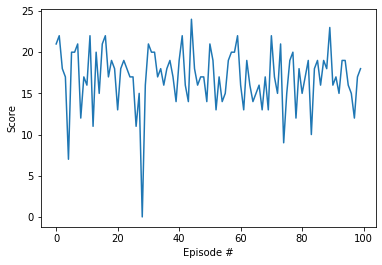
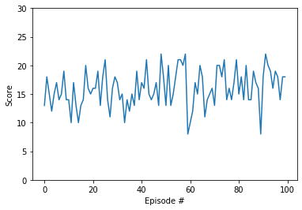

# Navigation project implementation 

### Tested strategies
Building the navigation project I was considering:
1. Implementing simple Deep Q-Network (DQN) like the one from the Udacity class with 3 linear layers   
   (see QNetwork in `model.py`) 
2. Trying to change number and size of layers
3. Adding dropout layers, and experimenting with layer sizes as well as dropout percentage.   

### Strategy comments
I considered trying:  
- dropout  
- double DQN   
- dueling DQN   
- prioritized experience replay   

I thought that prioritized experience replay might not be as relevant in this problem since there is no obvious   
issue with not enough occurrences of the behaviour we want to promote.  
In the time I allowed myself to spend on this project, I wanted to test only one other option, so I chose the   
dropout method.   

To figure out what different layers or different network architecture we should try, I thought it would be beneficial   
to understand better the state data, even though we want the RL to learn without knowing anything on the state.   
I think that this knowledge may in general help with hyper-parameter tuning and create Neural Net that   
learn faster and may achieve better model.  

State data:   
According to some comments in the course message more detail info on the states can be found in [Unity GitHub](https://github.com/Unity-Technologies/ml-agents/issues/1134)  
From those comments it appears that 2 of the 37 states are for velocities, 7 are angles of rays and   
5 are states [Banana {0,1}, Wall {0,1}, BadBanana {0,1}, Agent {0,1}, Distance {fraction of the ray length}]  
- example: [0, 1, 1, 0, 0.2], There is a BadBanana detected 20% of the way along the ray and a wall behind it.  
           

#### Ideas for Future Work
- Write a code that allows somewhat automated exploration of hyper-parameters   
  - number of layers, layers size
  - double DQN, dueling DQN, prioritized experience replay
  Do it in a way that compare over not to large number of episodes (something like 300)   
  that allows to get a sense on how fast and how well a particular approach is working
  - Change gamma and epsilon allowing them model to have less/more "memory" and less/more exploration    
  
- When running the learning process, it looked like the gradient optimizer was having some issues   
  around score 16, it was oscillating as if the step size is not proper, like it is overshooting or that it got   
  stack in some local minimum and was not able to get out.   
  Consider trying different gradient decent optimizers and see if we can get a sense on what are possible limits   
  of a perfect game, what scores we can hope to get if we have optimal model. 
  
- Let the leaning process run longer (I did not even get to 2000 episodes) and do not break the process when   
  reaching to a particular 100 episodes score average.   
  Instead, save `checkpoint.pth` whenever we get to a better 100 episodes score average.     

### Project work notes
Most of the project work and exploration was done using an IDE named pycharm that provides nice debugging tools   
using `Navigation_tools.py`.    
I copied and run some of the code in `Navigation.ipynb` since this can be simpler to used by others when downloading   
and trying this model. 

**Work notes and model exploration steps:**
- Basic environment exploration: 
  print states, action, explore code, modify curse code  
- Looking at average games scores info when playing multiple using uniformly random action selection   
- Train the model using DQN (3 linear layers state:64, 64:64, 64:actions)  
  trained model in: `checkpoint.pth`  
- Add layer and change sizes (4 linear layers state:128, 128:64, 64:32, 64:actions)     
  No meaningful improvement (it was slower to learn so I stopped the learning process)  
- Dropout layers: Back to 3 linear layers but add dropout layers  
  - tried several layers sizes and dropout percentages   
  Learn slightly faster (not tested rigorously)  
  trained model in: `checkpoint_dropout.pth`  
  - Model `QNetwork2` in `model.py`    
  - Goal was to see if we can train faster and if we can get better score.  
    - it got to 100 episodes score of 13.5 at episode 700  
    - There were oscillation when reached to average score of about 15.5, after episode 800  
    - Did not improved significantly even after 1,500 episodes   
  

### Results   
I stopped training when the 100 episodes average got to be > 15.5, so it is expected for models to give similar outcome.    
The model without the dropout got to a little better results when using it on 100 games (episodes)  
The model with the dropout appeared appeared to be learning faster.   

Result model average score over 100 episodes was **16.95** with median **17** (see plot below)   

#### Model used
Selected model DQN with 3 layers    
Model:   
fc1 = Linear(37, 64)  
fc2 = Linear(64, 64)  
fc3 = Linear(64, 4)   

Forward step using Relu functions:   
x = relu(fc1(state))   
x = relu(fc2(x))   
x = fc3(x)   

`model.pt` contains project model weights copied from `checkpoint.pth`   
model name in `model.py` is `QNetwork` which is `model_num=1`.   

#### Results stats and plots 

__DQN__    
Avg score: 16.95  
Min score: 0.0  
Max score: 24.0  
Median score: 17.0  

__DQN With Dropout__    
Avg score: 15.97   
Min score: 8.0  
Max score: 22.0  
Median score: 16.0  

   

